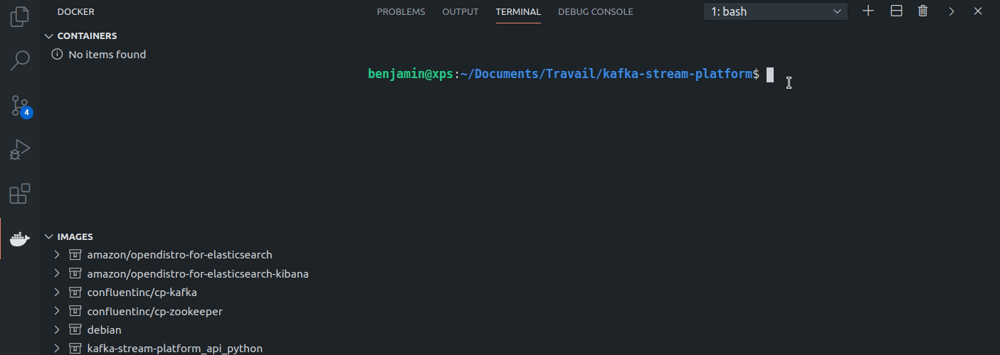

# kafka-stream-platform
This repository contains usecase of Kafka in Docker with other microservices 



## Quickstart

Before using `docker` we must generate certificates used by differents nodes to authenticate.

```console
$ sudo apt-get install -y openjdk-14-jre-headless
$ bash generate-cert.sh
```

To start containers I'm using `docker-compose`, but feel free to use something else if you feel more confident :

```console
$ docker-compose build -d --rm
```

### How to interact with kafka's cluster

Once you've run `docker-compose up -d` you can start by interaction with the python API at `127.0.0.1:5000`